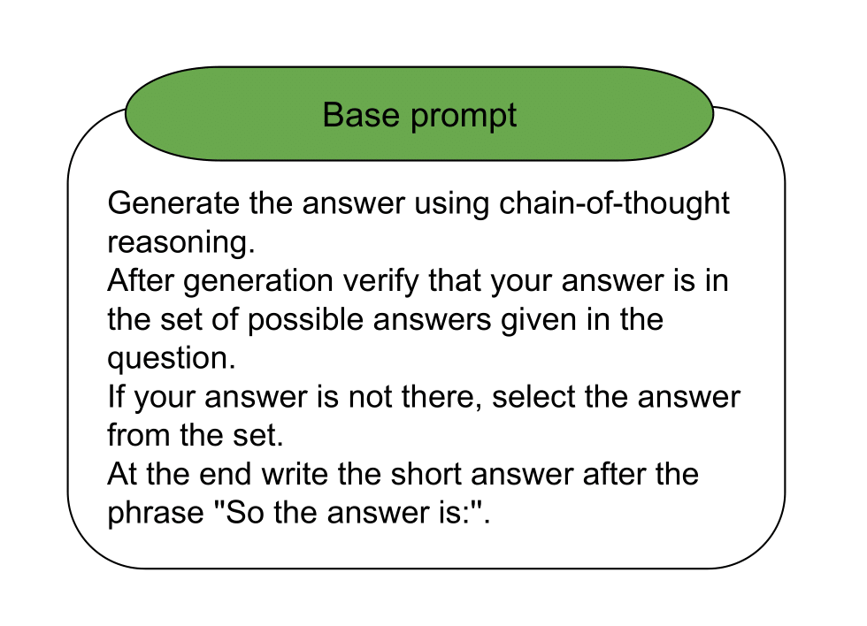

# TextGraphs-17

This repository presents the 2nd place solution in the shared task [TextGraphs-17](https://sites.google.com/view/textgraphs2024/home/shared-task): Graph-based Methods for Natural Language Processing.

 ### Description
The shared task is to select a KG entity (out of several candidates) which correspond to an answer given a textual question. The specificity of the task, is that for each question-answer (Q-A) pair not only textual Q-A pair is given but also a graph of shortest paths in the KG from entities in query to the LLM-generated candidate entity (including links of the intermediate nodes). This way, participants easily may experiment with various strategies of text-graph modality fusion for the given task in a controllable manner. 

### Method

The baseline is obtained with GPT-4 with CoT prompting and provided set of answers.

CoT prompt:

#### Detection of the center of the cells

