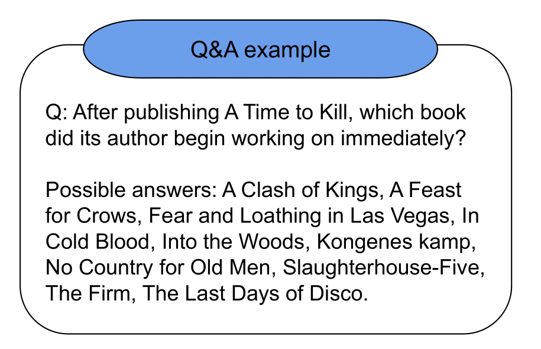
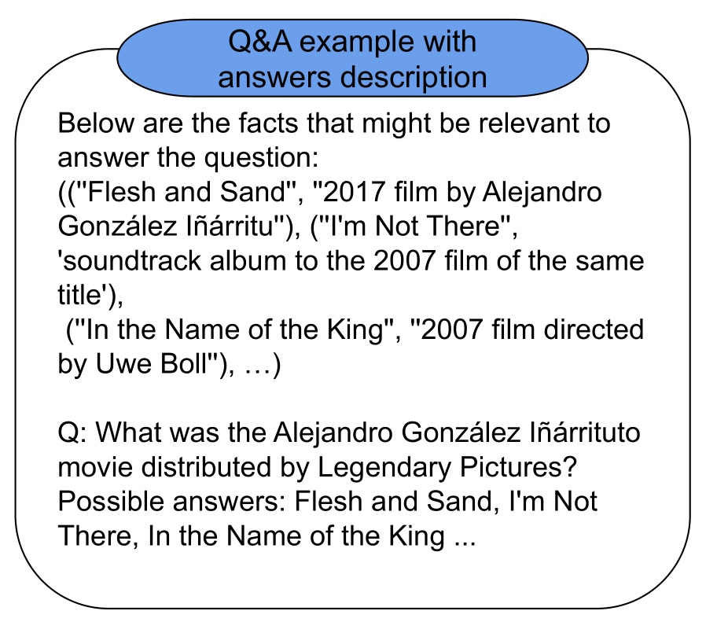

# TextGraphs-17

This repository presents the 2nd place solution in the shared task [TextGraphs-17](https://sites.google.com/view/textgraphs2024/home/shared-task): Graph-based Methods for Natural Language Processing.

 ### Description
The shared task is to select a KG entity (out of several candidates) which correspond to an answer given a textual question. The specificity of the task, is that for each question-answer (Q-A) pair not only textual Q-A pair is given but also a graph of shortest paths in the KG from entities in query to the LLM-generated candidate entity (including links of the intermediate nodes). This way, participants easily may experiment with various strategies of text-graph modality fusion for the given task in a controllable manner. 

### Method

The baseline is obtained with GPT-4 with CoT prompting and provided set of answers.

#### CoT prompt:

#### Answer example:

### Main tricks

#### Fixing multiple answers 

1) Among identical answers select the one with the minimal length of subgraph
2) Add Wikidata description of the answer and select the answer with the largest cosine similarity between mean of the fastText embeddings of the question and answer

#### Fixing NA answers
1) Ask LLM to rephrase the question to make it clearer for LLM to answer
2) Add Wikidata descriptions of entities as a context to the prompt:

### Requirements

All code is runable with requirements installed from: 

`requirements.txt`

### Code

In the notebook `TextGraphs_posteval_github_best.ipynb` is the code for all experiemnts tricks with data files stored in the `Data` folder.

In the notebook `TextGraphs_GPT4_prompt_example.ipynb` is the example of the base prompt to GPT4.

In the notebook `Wiki_collect_answer_description.ipynb` you may find a function for the collection of the Wikidata description of the entity.

### Citations

Please cite the paper and star this repo if you use the method and find it interesting/useful, thanks! Feel free to contact lysyuk.m.v@gmail.com or open an issue if you have any questions.

@inproceedings{lysyuk2024skoltech,
  title={Skoltech at TextGraphs-17 Shared Task: Finding GPT-4 Prompting Strategies for Multiple Choice Questions},
  author={Lysyuk, Maria and Braslavski, Pavel},
  booktitle={Proceedings of the Graph-based Methods for Natural Language Processing (TextGraphs)},
  year={2024}
}

